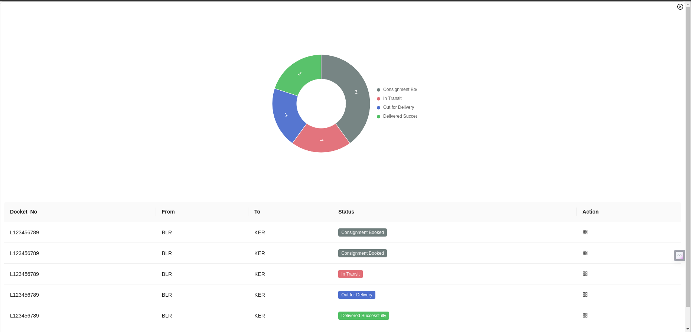
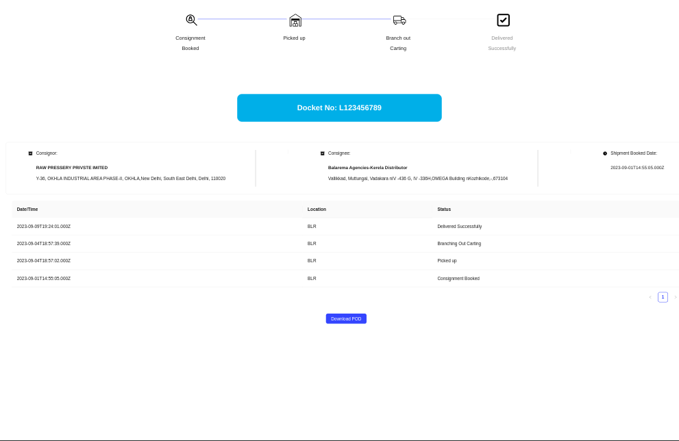

# Getting Started with DashboardUsingReact

Clone the repo
```
git clone <repo link>
cd DashboardUsingReact
```

## Available Scripts

To run the project
Install the dependency
```
npm install
```
```
npm start
```
## Output
Screen 1



Screen 2
